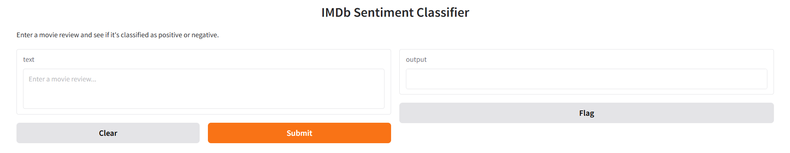

# IMDb Sentiment Analysis with DistilBERT

This project uses the DistilBERT transformer model to perform sentiment analysis on IMDb movie reviews. The model is fine-tuned on labeled reviews and predicts whether a given sentence is positive or negative.

---

## Project Structure

```
IMDb-Sentiment-Classifier/
├── data/
│   └── train.csv              ← Labeled dataset (sample)
├── model/                     ← Trained model files (not included in repo)
├── app.py                     ← Gradio demo script (for HF Spaces)
├── train.py                   ← Training script
├── predict.py                 ← Inference script
├── requirements.txt           ← Dependencies
└── README.md
```
---

## Live Demo on Hugging Face Spaces

You can try out the model directly in your browser using the web demo:

[Launch Web Demo](https://huggingface.co/spaces/semihsivrikaya11/IMDb-Sentiment-Classifier)

  
_Example usage of the Gradio-powered IMDb sentiment classifier web app._

---

## How to Train the Model

1. Place your training data at data/train.csv.  
   The file must include two columns:
   - text: The review sentence  
   - label: 0 = negative, 1 = positive

2. Run the training script:

    python train.py

3. After training:
   - The model and tokenizer will be saved under the model/ directory.
   - Logs will be saved under outputs/logs/.


### Download Trained Model (MEGA)

Due to GitHub's file size limit, the model is not included in the repository.  
You can download it from the following link and place it under the `model/` folder:
[Download model.zip from MEGA](https://mega.nz/file/tlA0DYIY#x0IIChJS-BchN7HdARZBJwkyfWlgVJkGGKIKkwyjeZ4)

---

## How to Predict Sentiment

Once the trained model is available under the model/ folder, run:

    python predict.py

You will see outputs like:

    'This movie was amazing!' → positive  
    'I hated this film.' → negative

You may customize predict.py to accept user input or test batch files.

---

## Installation

To install the necessary dependencies:

    pip install -r requirements.txt

Contents of requirements.txt:

    transformers
    torch
    scikit-learn
    pandas
    gradio

---

## Model Details

This project fine-tunes the distilbert-base-uncased model using Hugging Face Transformers and PyTorch.

- Tokenizer: DistilBertTokenizer
- Model: DistilBertForSequenceClassification
- Max input length: 512 tokens
- Batch size: 16
- Epochs: 2
- Output directory: model/
- Logs: outputs/logs/
- Web App Interface: Gradio 
---
---

## Evaluation Results

The model was evaluated on a 20% split from the original training data.  
Here are the performance metrics based on that validation set:

| Metric     | Score  |
|------------|--------|
| Accuracy   | 95.00% |
| F1 Score   | 94.12% |
| Precision  | 96.39% |
| Recall     | 91.95% |

These results indicate that the model is not only highly accurate but also balanced in terms of false positives and false negatives. It performs well in both detecting positive and negative sentiment accurately.


## References

- Hugging Face Transformers Documentation: https://huggingface.co/docs/transformers
- BERT: Pre-training of Deep Bidirectional Transformers for Language Understanding: https://arxiv.org/abs/1810.04805
- DistilBERT: A distilled version of BERT: https://arxiv.org/abs/1910.01108
- IMDb Dataset on Kaggle: https://www.kaggle.com/datasets/lakshmi25npathi/imdb-dataset-of-50k-movie-reviews
- Stanford NLP - Sentiment Analysis: https://nlp.stanford.edu/sentiment/


---

_This project was developed for learning and demonstration purposes by [Semih Sivrikaya](https://github.com/semihsivrikaya11)._
